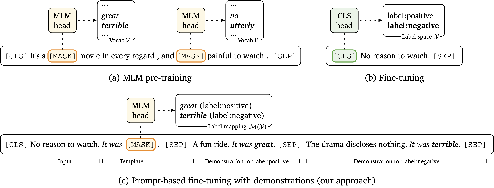

# LM-BFF (**B**etter **F**ew-shot **F**ine-tuning of **L**anguage **M**odels)

This is the implementation of the paper [Making Pre-trained Language Models Better Few-shot Learners](https://arxiv.org/pdf/2012.15723.pdf). LM-BFF is short for **b**etter **f**ew-shot **f**ine-tuning of **l**anguage **m**odels.

## Quick links

* [Overview](#overview)
* [Requirements](#requirements)
* [Prepare the data](#prepare-the-data)
* [Run the model](#run-lm-bff)
  * [Quick start](#quick-start)
  * [Experiments with multiple runs](#experiments-with-multiple-runs)
  * [Using demonstrations with filtering](#using-demonstrations-with-filtering)
  * [Automatically searched prompt](#automatically-searched-prompt)
  * [Ensemble](#ensemble-model)
  * [Zero-shot experiments](#zero-shot-experiments)
  * [How to design your own templates](#how-to-design-your-own-templates)
* [Citation](#citation)


## Overview



In this work we present LM-BFF, a suite of simple and complementary techniques for fine-tuning pre-trained language models on a small number of training examples. Our approach includes:

1. Prompt-based fine-tuning together with a novel pipeline for automating prompt generation.
2. A refined strategy for incorporating demonstrations into context.

You can find more details of this work in our [paper](https://arxiv.org/pdf/2012.15723.pdf).

## Requirements

To run our code, please install all the dependency packages by using the following command:

```
pip install -r requirements.txt
```

**NOTE**: Different versions of packages (like `pytorch`, `transformers`, etc.) may lead to different results from the paper. However, the trend should still hold no matter what versions of packages you use.

## Prepare the data

We pack the original datasets (SST-2, SST-5, MR, CR, MPQA, Subj, TREC, CoLA, MNLI, SNLI, QNLI, RTE, MRPC, QQP, STS-B) [here](https://nlp.cs.princeton.edu/projects/lm-bff/datasets.tar). Please download it and extract the files to `./data/original`, or run the following commands:

```bash
cd data
bash download_dataset.sh
```

Then use the following command (in the root directory) to generate the few-shot data we need:

```bash
python tools/generate_k_shot_data.py
```

See `tools/generate_k_shot_data.py` for more options. For results in the paper, we use the default options: we take `K=16` and take 5 different seeds of 13, 21, 42, 87, 100. The few-shot data will be generated to `data/k-shot`. In the directory of each dataset, there will be folders named as `$K-$SEED` indicating different dataset samples. You can use the following command to check whether the generated data are exactly the same as ours:

```bash
cd data/k-shot
md5sum -c checksum
```

**NOTE**: During training, the model will generate/load cache files in the data folder. If your data have changed, make sure to clean all the cache files (starting with "cache").

## Run LM-BFF

### Quick start
Our code is built on [transformers](https://github.com/huggingface/transformers) and we use its `3.4.0` version. Other versions of `transformers` might cause unexpected errors.

Before running any experiments, create the result folder by `mkdir result` to save checkpoints. Then you can run our code with the following example:

```bash
python run.py \
    --task_name SST-2 \
    --data_dir data/k-shot/SST-2/16-42 \
    --overwrite_output_dir \
    --do_train \
    --do_eval \
    --do_predict \
    --evaluate_during_training \
    --model_name_or_path roberta-large \
    --few_shot_type prompt-demo \
    --num_k 16 \
    --max_steps 1000 \
    --eval_steps 100 \
    --per_device_train_batch_size 2 \
    --learning_rate 1e-5 \
    --num_train_epochs 0 \
    --output_dir result/tmp \
    --seed 42 \
    --template "*cls**sent_0*_It_was*mask*.*sep+*" \
    --mapping "{'0':'terrible','1':'great'}" \
    --num_sample 16 \
```

Most arguments are inherited from `transformers` and are easy to understand. We further explain some of the LM-BFF's arguments:

* `few_shot_type`: There are three modes
  * `finetune`: Standard fine-tuning
  * `prompt`: Prompt-based fine-tuning.
  * `prompt-demo`: Prompt-based fine-tuning with demonstrations.
* `num_k`: Number of training instances for each class. We take `num_k`=16 in our paper. This argument is mainly used for indexing logs afterwards (because the training example numbers are actually decided by the data split you use).
* `template`: Template for prompt-based fine-tuning. We will introduce the template format later.
* `mapping`: Label word mapping for prompt-based fine-tuning. It is a string of dictionary indicating the mapping from label names to label words. **NOTE**: For RoBERTa, the model will automatically add space before the word. See the paper appendix for details.
* `num_sample`: When using demonstrations during inference, the number of samples for each input query. Say `num_sample`=16, then we sample 16 different sets of demonstrations for one input, do the forward seperately, and average the logits for all 16 samples as the final prediction.

Also, this codebase supports BERT-series and RoBERTa-series pre-trained models in Huggingface's `transformers`. You can check [Huggingface's website](https://huggingface.co/models) for available models and pass models with a "bert" or "roberta" in their names to `--model_name_or_path`. Some examples would be `bert-base-uncased`, `bert-large-uncased`, `roberta-base`, `roberta-large`, etc.

To easily run our experiments, you can also use `run_experiment.sh` (this command runs prompt-based fine-tuning with demonstrations, no filtering, manual prompt):

```bash
TAG=exp TYPE=prompt-demo TASK=SST-2 BS=2 LR=1e-5 SEED=42 MODEL=roberta-large bash run_experiment.sh
```

We have already defined the templates and label word mappings in it, so you only need manipulate several hyper-parameters and `TAG` (you can use whatever tag you want and it just makes finding results easier). See `run_experiment.sh` for more options of these environment variables. Besides, you can add extra arguments by

```bash
TAG=exp TYPE=prompt-demo TASK=SST-2 BS=2 LR=1e-5 SEED=42 MODEL=roberta-large bash run_experiment.sh "--output_dir result/exp --max_seq_length 512"
```

### Experiments with multiple runs

To carry out experiments with multiple data splits, as the evaluation protocol detailed in \$3.3 of [our paper](https://arxiv.org/pdf/2012.15723.pdf) (grid-search for each seed and aggregate the results over 5 different seeds), you can use the following scripts:

```bash
for seed in 13 21 42 87 100
do
    for bs in 2 4 8
    do
        for lr in 1e-5 2e-5 5e-5
        do
            TAG=exp \
            TYPE=prompt-demo \
            TASK=SST-2 \
            BS=$bs \
            LR=$lr \
            SEED=$seed \
            MODEL=roberta-large \
            bash run_experiment.sh
        done
    done
done
```

All the results will be stored in `./log`. To gather all the results, run the following command:

```bash
python tools/gather_result.py --condition "{'tag': 'exp', 'task_name': 'sst-2', 'few_shot_type': 'prompt-demo'}"
```

Then the program will find all the trials that satisfy the condition in `./log`, and print the mean/std of the final results. Note that the task names are all lower-cased and if the task has more than one metric, you need to specify the major metric (used for taking the best validation trial) in the name (e.g., `mnli`, `mnli-mm`, `mrpc/acc`, `mrpc/f1`, `qqp/acc`, `qqp/f1`, `sts-b/pearson`, `sts-b/spearman`).

### Using demonstrations with filtering

To use the filtering mechanism when using demonstrations, we need to first generate [Sentence-BERT](https://github.com/UKPLab/sentence-transformers) embeddings. To generate embeddings for datasets in our paper, you can directly run

```
bash tools/get_sbert_embedding.sh roberta-large
```

`roberta-large` can also be replaced by `bert-base`, `bert-large`, `roberta-base` and `distilbert-base` (see [Sentence Transformers](https://github.com/UKPLab/sentence-transformers) for details). See `tools/get_sbert_embedding.sh` and `tools/get_sbert_embedding.py` if you want to add more datasets.

After generating the embeddings (embeddings are saved as numpy files in the data folders), we can run the following commands to do prompt-based fine-tuning with demonstrations with filtering:

```bash
TAG=exp TYPE=prompt-demo TASK=SST-2 BS=2 LR=1e-5 SEED=42 MODEL=roberta-large bash run_experiment.sh "--demo_filter --demo_filter_model sbert-roberta-large"
```

### Automatically searched prompt

We provide our automatic search results in `auto_template` and `auto_label_mapping`. There are three types of files:

* `SST-2/16-42.txt`: Initial search results for SST-2 dataset, K=16 and SEED=42.
* `SST-2/16-42.sort.txt`: Do prompt-based fine-tuning on initial results and sort them based on dev set performance.
* `SST-2/16-42.score.txt`: Same as above, but with dev set scores.

To use the best automatic template (`auto-T` in the paper), use the following command:

```bash
TAG=exp TYPE=prompt-demo TASK=SST-2 BS=2 LR=1e-5 SEED=42 MODEL=roberta-large bash run_experiment.sh "--template_path auto_template/SST-2/16-42.sort.txt --template_id 0"
```

You can also use the _i_-th automatic result by specifying different `template_id`.

Similarly, to use automatic label (`auto-L` in the paper), use the following command:

```bash
TAG=exp TYPE=prompt-demo TASK=SST-2 BS=2 LR=1e-5 SEED=42 MODEL=roberta-large bash run_experiment.sh "--mapping_path auto_label_mapping/SST-2/16-42.sort.txt --mapping_id 0"
```

**NOTE**: Make sure to use the corresponding automatic search results with different data split seeds.

**Our final results (LM-BFF) take prompt-based fine-tuning with demonstrations, filtering and automatic template, for example**:

```bash
for seed in 13 21 42 87 100
do
    for bs in 2 4 8
    do
        for lr in 1e-5 2e-5 5e-5
        do
            TAG=LM-BFF \
            TYPE=prompt-demo \
            TASK=SST-2 \
            BS=$bs \
            LR=$lr \
            SEED=$seed \
            MODEL=roberta-large \
            bash run_experiment.sh "--template_path auto_template/SST-2/16-$seed.sort.txt --template_id 0 --demo_filter --demo_filter_model sbert-roberta-large"
        done
    done
done

python tools/gather_result.py --condition "{'tag': 'LM-BFF', 'task_name': 'sst-2', 'few_shot_type': 'prompt-demo'}"
```

#### Search for automatic templates

If you want to try automatically generating templates by yourself, here are the instructions. Note that it is an extremely long process :)

To get automatic templates, we first generate template candidates by using T5:

```bash
python tools/generate_template.py \
    --output_dir my_auto_template \
    --task_name SST-2 \
    --seed 13 21 42 87 100 \
    --t5_model t5-3b \
    --beam 100
```

Where `--t5_model` specifies the pre-trained T5 checkpoint to use and `--beam` specifies the beam search width. Note that `t5-3b` model will take approximately 15GB GPU memory, and if your GPU does not support it, you can try smaller T5 models (e.g., `t5-base`).

Then we do prompt-based fine-tuning of all the templates

```bash
for template_id in {0..99}
do
    for seed in 13 21 42 87 100
    do
        # To save time, we fix these hyper-parameters
        bs=8
        lr=1e-5

        # Since we only use dev performance here, use --no_predict to skip testing
        TAG=exp-template \
        TYPE=prompt \
        TASK=SST-2 \
        BS=$bs \
        LR=$lr \
        SEED=$seed \
        MODEL=roberta-large \
        bash run_experiment.sh "--template_path my_auto_template/SST-2/16-$seed.txt --template_id $template_id --no_predict"
    done
done
```

... and sort them based on dev set performance:

```bash
python tools/sort_template.py --condition "{'tag': 'exp-template', 'task_name': 'sst-2'}" --template_dir my_auto_template
```

The sorted results will be saved in `my_auto_template`, with the same format as described in [Automatically searched prompt](#automatically-searched-prompt).

#### Search for automatic label word mappings

Similar to the process of automatic template search, we first generate candidate label word mappings by running:

```bash
bash tools/run_generate_labels.sh
```

You can modify the options in `tools/run_generate_labels.sh` to run this for different datasets or save mappings to different directories. After running the generation, the candidate label mappings will be saved in `my_auto_label_mapping/manual_template`.

Then we do prompt-based fine-tuning of all the mappings by:

```bash
for mapping_id in {0..99}
do
    for seed in 13 21 42 87 100
    do
        # To save time, we fix these hyper-parameters
        bs=8
        lr=1e-5

        # Since we only use dev performance here, use --no_predict to skip testing
        TAG=exp-mapping \
        TYPE=prompt \
        TASK=SST-2 \
        BS=$bs \
        LR=$lr \
        SEED=$seed \
        MODEL=roberta-large \
        bash run_experiment.sh "--mapping_path my_auto_label_mapping/manual_template/SST-2/16-$seed.txt --mapping_id $mapping_id --no_predict"
    done
done
```

... and sort them based on dev set performance:

```bash
python tools/sort_mapping.py --condition "{'tag': 'exp-mapping', 'task_name': 'sst-2'}" --mapping_dir my_auto_label_mapping/manual_template
```

The sorted results will be saved in `my_auto_label_mapping/manual_template`, with the same format as described in [Automatically searched prompt](#automatically-searched-prompt).

**Auto T + L**: We can also do a joint search of templates and label word mappings following these steps:

1. First, do the automatic template search following [Search for automatic templates](#search-for-automatic-templates).
2. The following steps are similar to automatic label mapping except a few arguments. When running `tools/run_generate_labels.sh`, change `LOAD_TEMPLATES` to `true` in it and the template + mapping candidates will be written in `my_auto_label_mapping/auto_template`
3. For the following fine-tuning, change `--mapping_path` and `--mapping_id` to `--prompt_path` and `--prompt_id`.
4. In the end, for re-ranking all the prompts, change `tools/sort_mapping.py` to `tools/sort_prompt.py` to get the final lists.

### Ensemble model

First we need to train models with different templates:

```bash
mkdir ensemble_predict_results
for template_id in {0..19} # Use top 20 templates
do
    array_id=0
    for seed in 13 21 42 87 100
    do
        for bs in 2 4 8
        do
            for lr in 1e-5 2e-5 5e-5
            do
                TAG=exp-ensemble \
                TYPE=prompt-demo \
                TASK=SST-2 \
                BS=$bs \
                LR=$lr \
                SEED=$seed \
                MODEL=roberta-large \
                bash run_experiment.sh "--template_path auto_template/SST-2/16-$seed.sort.txt --template_id $template_id --model_id $template_id --array_id $array_id --save_logit --save_logit_dir ensemble_predict_results"

                array_id=$(expr $array_id + 1)
            done
        done
    done
done
```

Looks a little complicated? It's actually pretty easy to understand: `--model_id` and `--array_id` is used to distinguish different runs, and `--save_logit` tells the program to save the prediction results for ensemble.

After finishing the experiments, use the following command to get the ensemble results:

```bash
python tools/ensemble.py --condition "{'tag': 'exp-ensemble', 'task_name': 'sst-2', 'few_shot_type': 'prompt-demo'}" --n_models 20
```

where `--n_models` specify how many models you want to use for ensemble (should be kept the same as the number of templates you use in experiments).

### Zero-shot experiments

It's easy to run zero-shot experiments: just add the `--no_train` argument:

```bash
TAG=zero-shot TYPE=prompt TASK=SST-2 BS=2 LR=1e-5 SEED=42 MODEL=roberta-large bash run_experiment.sh "--no_train"
```

To do "GPT-3 style" in-context learning:

```bash
TAG=gpt3-in-context TYPE=prompt-demo TASK=SST-2 BS=2 LR=1e-5 SEED=42 MODEL=roberta-large bash run_experiment.sh "--no_train --num_sample 1 --gpt3_in_context_head --gpt3_in_context_num 32 --truncate_head --use_full_length"
```

### How to design your own templates

Here are two template examples:

For SST-2: `*cls**sent_0*_It_was*mask*.*sep+*` => `[CLS] {S0} It was [MASK]. [SEP]`

For MNLI: `*cls**sent-_0*?*mask*,*+sentl_1**sep+*` => `[CLS] {S0}? [MASK], {S1} [SEP]`

The template is composed of special tokens and variables (surrounded by `*`) and text (e.g., `It_was`, where space is replaced by `_`). Special tokens and variables contain:

* `*cls*`, `*sep*`, `*sep+*` and `*mask*`: Special tokens of CLS, SEP and MASK (different for different pre-trained models and tokenizers). `*sep+*` means the contents before and after this token have different segment embeddings (only for BERT).
* `*sent_i*`: The i-th sentence.
* `*sent-_i*`: The i-th sentence, discarding the last character.
* `*sentl_i*`: The i-th sentence, lower-casing the first letter.
* `*sentl-_i*`: The i-th sentence, discarding the last character and lower-casing the first letter.
* `*+sent_i*`: The i-th sentence, adding an extra space at the beginning.
* `*+sentl_i*`: The i-th sentence, adding an extra space at the beginning and lower-casing the first letter.


## Bugs or questions?

If you have any questions related to the code or the paper, feel free to email Tianyu (`tianyug@cs.princeton.edu`). If you encounter any problems when using the code, or want to report a bug, you can open an issue. Please try to specify the problem with details so we can help you better and quicker!

## Citation

Please cite our paper if you use LM-BFF in your work:

```bibtex
@inproceedings{gao2021making,
   title={Making Pre-trained Language Models Better Few-shot Learners},
   author={Gao, Tianyu and Fisch, Adam and Chen, Danqi},
   booktitle={Association for Computational Linguistics (ACL)},
   year={2021}
}
```
